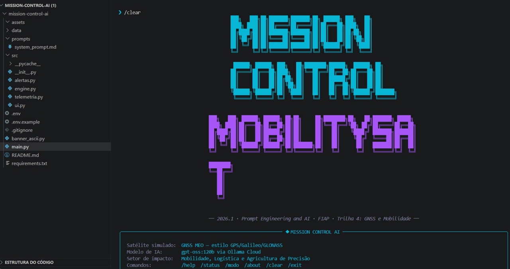
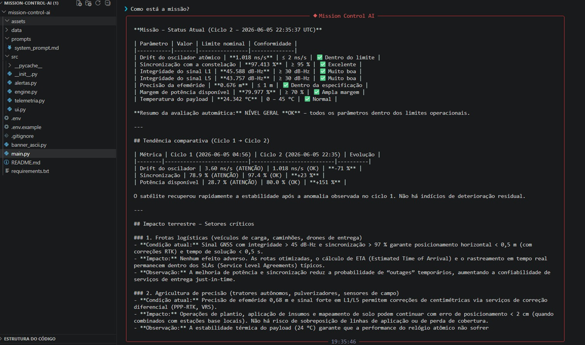

#  Mission Control AI — MobilitySat

> Sistema inteligente de monitoramento operacional de satélite GNSS com análise por IA generativa.  
> **FIAP · Ciência da Computação · Global Solution 2026.1 · Trilha 4: MobilitySat**

---

##  Integrantes

| Nome Completo | RM | Turma |
|---|---|---|
| Arthur Machado | RM569919 | 1CCPJ |
| Conrado Gracie| RM569157 | 1CCPJ |
| Renato Sandreschi| RM569156 | 1CCPJ |

---

##  O que o projeto faz

**Mission Control AI — MobilitySat** é um sistema de monitoramento operacional de satélite GNSS de navegação que:

1. **Simula** dados de telemetria de um satélite estilo GPS/Galileo/GLONASS (7 parâmetros em tempo real)
2. **Detecta anomalias** via lógica de thresholds em Python puro — sem depender da IA para decisões críticas
3. **Aciona respostas automatizadas** para situações de crise (modo economia, protocolo de re-sync, failover de sinal)
4. **Analisa** o estado da missão em linguagem natural via IA generativa (Ollama Cloud · gpt-oss:120b)
5. **Articula o impacto terrestre** de cada anomalia para frotas logísticas, agricultura de precisão e veículos autônomos

---

##  Persona atendida

O sistema atende três personas simultaneamente:

- ** Engenheiro de segmento espacial** — linguagem técnica, valores exatos, recomendações de protocolo
- ** Gestor de frota logística** — precisa saber se as rotas dos seus 3.200 veículos estão confiáveis
- ** Operador de agricultura de precisão** — precisa saber se os drones e plantadeiras autônomas podem operar em 180.000 ha

---

##  Proposta de valor / modelo de negócio

### 1. Problema real terrestre que esta missão resolve

O agronegócio e a logística brasileira dependem crescentemente de posicionamento GNSS de alta precisão. Uma degradação silenciosa do satélite — um drift de oscilador de 6 ns/s, por exemplo — causa erro sistemático de +9 metros no campo. Plantadeiras autônomas desviam dos sulcos de plantio, caminhões seguem rotas incorretas e drones de pulverização atingem áreas erradas. O problema: **nenhum operador terrestre vê isso acontecendo em tempo real, em linguagem que entende.**

### 2. Quem paga pela solução

Modelo híbrido:
- **Setor privado:** operadoras de frotas logísticas, cooperativas agrícolas e startups de agricultura de precisão pagam assinatura mensal pelo dashboard de saúde do sinal GNSS.
- **Setor público:** AEB e INPE pagam licença institucional para monitoramento da constelação nacional hipotética.

### 3. Métrica de impacto

Se o satélite operar 100% saudável por 1 ano:
- **~180.000 hectares** monitorados com precisão sub-métrica no Cerrado e Sul do Brasil
- **~3.200 veículos** com otimização de rota contínua — estimativa de 8% de redução em consumo de combustível
- **~420 toneladas de CO₂** evitadas por eficiência logística
- **1 porto automatizado** (Santos) operando sem interrupção de GNSS de precisão

### 4. Modelo de negócio

**SaaS + Dado-como-serviço:**
- Assinatura mensal para operadores de frota e agricultores (R$ 800–4.500/mês por conta)
- API de status de sinal com SLA para integradores de sistemas embarcados
- Relatórios de conformidade para seguradoras agrícolas com base em uptime do satélite

---

##  Tecnologias utilizadas

- **Python 3.10+** — linguagem principal, comentários em português
- **Ollama Cloud API** — modelo `gpt-oss:120b` para análise em linguagem natural
- **Rich 15.0.0** — painéis, tabelas e formatação no terminal
- **prompt-toolkit 3.0.52** — input editável com histórico
- **pyfiglet 1.0.4** — banner ASCII art
- **python-dotenv 1.0.1** — gerenciamento seguro de credenciais

---

##  Como executar

### Pré-requisitos

- Python 3.10 ou superior
- Conta gratuita no [Ollama Cloud](https://ollama.com) com API Key gerada

### Instalação

```bash
# 1. Clone o repositório
git clone https://github.com/usuario/mission-control-ai.git
cd mission-control-ai

# 2. Crie ambiente virtual (recomendado)
python -m venv .venv
source .venv/bin/activate       # Linux/Mac
.venv\Scripts\activate          # Windows

# 3. Instale as dependências
pip install -r requirements.txt

# 4. Configure as credenciais
cp .env.example .env
# Edite o arquivo .env e adicione sua API Key do Ollama:
# OLLAMA_API_KEY=sua_chave_aqui

# 5. Execute o sistema
python main.py
```

---

##  Comandos da CLI

| Comando | Descrição |
|---|---|
| `/help` | Exibe tabela de comandos |
| `/status` | Snapshot completo da telemetria atual |
| `/modo normal` | Simula operação saudável |
| `/modo alerta` | Simula parâmetros em zona de atenção |
| `/modo critico` | Simula crise com múltiplos parâmetros fora do range |
| `/modo aleatorio` | Varia entre os modos probabilisticamente (padrão) |
| `/about` | Informações sobre a missão e trilha |
| `/clear` | Limpa o terminal |
| `/exit` | Encerra o sistema |
| [qualquer pergunta] | Analisa telemetria e responde via IA |

---

##  Demonstração




---

##  System Prompt

O system prompt completo está em [`prompts/system_prompt.md`](prompts/system_prompt.md).

Destaques da estratégia de prompting:
- **Persona específica:** define explicitamente as 3 personas atendidas
- **Tabela de thresholds:** injeta conhecimento de domínio diretamente no prompt
- **Few-shot example:** inclui exemplo de análise bem-feita para guiar o modelo
- **Formato de saída:** especifica estrutura da resposta (status → detalhes → impacto → ação)

---

##  Cenários de teste demonstrados

1. **Operação normal** — todos os parâmetros dentro do range (`/modo normal`)
2. **Drift crítico do oscilador** — impacto no posicionamento das frotas (`/modo critico`)
3. **Potência crítica** — modo economia automatizado, sistemas dual-freq afetados (`/modo critico`)
4. **Sinal L1/L5 degradado** — failover de sinal ativado, notificação de clientes (`/modo alerta`)
5. **Crise múltipla** — vários parâmetros críticos simultâneos com análise consolidada (`/modo critico`)

---

##  Limitações conhecidas

- Dados de telemetria são **simulados** — não provêm de satélite real nem de TLE/SGP4
- O modelo `gpt-oss:120b` é não-determinístico: respostas variam entre execuções com mesmos dados
- A memória de histórico é **em sessão** — reiniciar o sistema limpa o histórico de ciclos
- Latência da Ollama Cloud pode variar (1–8 segundos por consulta) dependendo de carga
- Sem interface gráfica — sistema é exclusivamente CLI conforme especificado no enunciado

---

##  Vídeo de demonstração

🔗 [Assistir demonstração no YouTube](https://youtu.be/QTlQlm--moY)

---

*FIAP · Ciência da Computação · Global Solution 2026.1*  
*Disciplina: Prompt Engineering and Artificial Intelligence*
